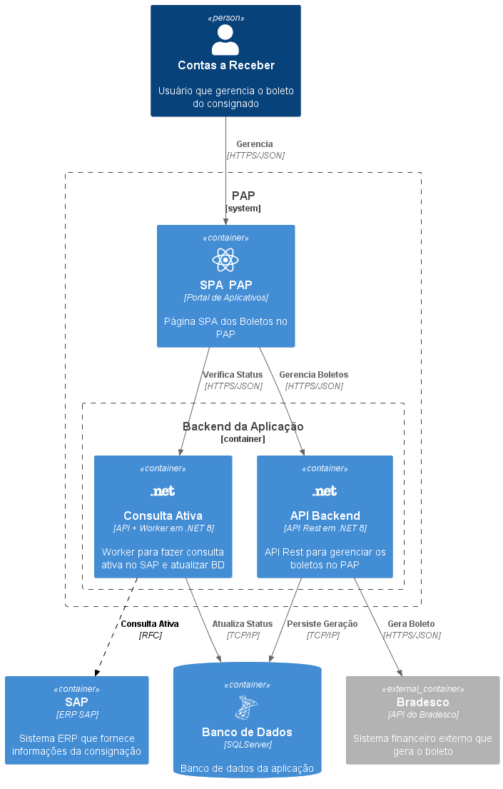

# Editora - Boletos

Este repositório contém o projeto **Editora** para emitir boletos para livreiros.

## Funcionalidades

- Emitir e gerenciar boletos para pagamento de consignação.

## Tecnologias Utilizadas

- .NET / C#
- SQL Server
- SAP

## Arquitetura

- Diagramas para ajudar a esclarecer a aplicação

### Caso de Uso Principal

### Diagrama de Contexto

### Container Principal

## Licença

Este projeto está licenciado sob a licença MIT.